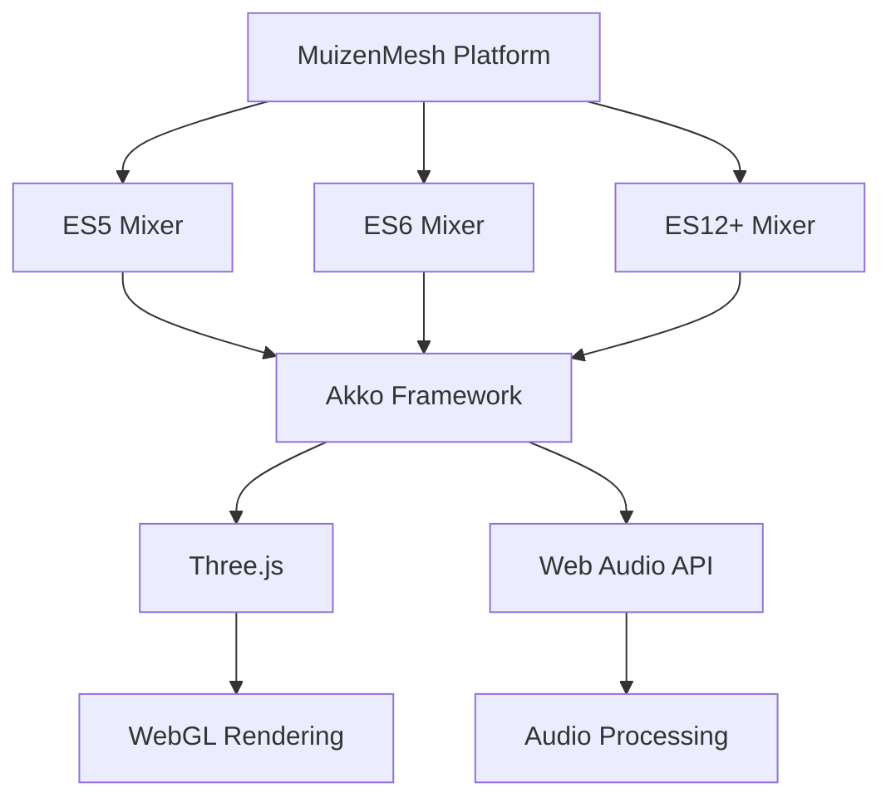

# MuizenMesh Documentation

Welcome to the MuizenMesh project documentation. This directory contains comprehensive guides for all components of the MuizenMesh platform.

## 📚 Documentation Index

### Core Components

- **[ES12+ Mixer](ES12-MIXER.md)** - Complete guide to the cutting-edge ES12+ audio visualizer
- **[Mixer Comparison](MIXER-COMPARISON.md)** - Detailed comparison of ES5, ES6, and ES12+ mixer versions

### Quick Links

- [Getting Started](#getting-started)
- [Development Setup](#development-setup)
- [Architecture Overview](#architecture-overview)
- [Contributing](#contributing)

## 🚀 Getting Started

### Prerequisites

- Modern web browser (Chrome 94+, Firefox 93+, Safari 15+)
- Node.js 16+ (for development)
- Netlify CLI (recommended)

### Quick Start

1. **Clone the repository**
   ```bash
   git clone [repository-url]
   cd muizenmesh
   ```

2. **Start development server**
   ```bash
   netlify dev
   ```

3. **Access the mixers**
   - ES5 Mixer: `http://localhost:8888/mixer/`
   - ES6 Mixer: `http://localhost:8888/mixer-es6/`
   - ES12+ Mixer: `http://localhost:8888/mixer-es12/`

## 🏗️ Development Setup

### Environment Configuration

The project uses Netlify for deployment and local development. Key configuration files:

- `netlify.toml` - Netlify configuration and headers
- `.nvmrc` - Node.js version specification
- `package.json` - Project dependencies

### Local Development

```bash
# Install Netlify CLI
npm install -g netlify-cli

# Start local development server
netlify dev

# Alternative: Python server (basic)
python3 -m http.server 8888
```

### Browser Requirements

| Feature | Chrome | Firefox | Safari | Edge |
|---------|--------|---------|--------|------|
| ES5 Mixer | Any | Any | Any | Any |
| ES6 Mixer | 61+ | 60+ | 10.1+ | 16+ |
| ES12+ Mixer | 94+ | 93+ | 15+ | 94+ |

## 🏛️ Architecture Overview

### Project Structure

```
muizenmesh/
├── docs/                   # Documentation
├── mixer/                  # ES5 mixer (legacy)
├── mixer-es6/             # ES6 mixer (modern)
├── mixer-es12/            # ES12+ mixer (cutting-edge)
├── Akko/                  # Audio visualization framework
├── css/                   # Global styles
├── js/                    # Global JavaScript
├── images/                # Static assets
└── netlify.toml          # Deployment configuration
```

### Technology Stack

- **Frontend**: HTML5, CSS3, JavaScript (ES5/ES6/ES12+)
- **3D Graphics**: Three.js
- **Audio**: Web Audio API, Akko Framework
- **Deployment**: Netlify
- **Development**: Netlify Dev, Python HTTP Server

### Component Relationships



## 🎵 Mixer Versions

### ES5 Mixer (`/mixer/`)
- **Target**: Maximum browser compatibility
- **Features**: Function constructors, prototype inheritance
- **Use Case**: Legacy browser support

### ES6 Mixer (`/mixer-es6/`)
- **Target**: Modern browsers (2015+)
- **Features**: ES6 classes, modules, arrow functions
- **Use Case**: Production applications

### ES12+ Mixer (`/mixer-es12/`)
- **Target**: Cutting-edge browsers (2021+)
- **Features**: Private fields, optional chaining, top-level await
- **Use Case**: Showcasing modern JavaScript

## 🛠️ Development Workflow

### Adding New Features

1. **Choose Target Version**
   - ES5: Maximum compatibility
   - ES6: Production ready
   - ES12+: Modern features

2. **Create Components**
   ```bash
   # ES12+ visualizer example
   touch mixer-es12/js/components/NewVisualizer.js
   ```

3. **Follow Patterns**
   - Use appropriate JavaScript version features
   - Maintain consistency with existing code
   - Document new functionality

4. **Test Across Browsers**
   - Verify feature support
   - Test audio reactivity
   - Check performance impact

### Code Style Guidelines

#### ES5 Style
```javascript
function Visualizer() {
    this.property = value;
}

Visualizer.prototype.method = function() {
    // Implementation
};
```

#### ES6 Style
```javascript
export default class Visualizer {
    constructor() {
        this.property = value;
    }
    
    method() {
        // Implementation
    }
}
```

#### ES12+ Style
```javascript
export default class Visualizer {
    #privateField = value;
    
    constructor() {
        this.#privateField ??= defaultValue;
    }
    
    #privateMethod() {
        // Implementation
    }
}
```

## 🧪 Testing

### Manual Testing

1. **Audio Functionality**
   - Load audio files
   - Test microphone input
   - Verify audio visualization

2. **Visual Quality**
   - Check rendering performance
   - Verify visual effects
   - Test different audio sources

3. **Browser Compatibility**
   - Test target browser versions
   - Verify feature support
   - Check error handling

### Automated Testing

```bash
# Future: Add automated testing
npm test
```

## 🤝 Contributing

### Getting Started

1. **Fork the repository**
2. **Create feature branch**
   ```bash
   git checkout -b feature/new-visualizer
   ```
3. **Make changes**
4. **Test thoroughly**
5. **Submit pull request**

### Contribution Guidelines

- Follow existing code patterns
- Document new features
- Test across target browsers
- Update documentation
- Maintain backward compatibility

### Areas for Contribution

- **New Visualizers**: Create audio-reactive visualizations
- **Performance Optimization**: Improve rendering efficiency
- **Browser Support**: Extend compatibility
- **Documentation**: Improve guides and examples
- **Testing**: Add automated test coverage

## 📖 Additional Resources

### External Documentation

- [Three.js Documentation](https://threejs.org/docs/)
- [Web Audio API Guide](https://developer.mozilla.org/en-US/docs/Web/API/Web_Audio_API)
- [ES2022 Features](https://2ality.com/2021/09/es2022.html)
- [Netlify Documentation](https://docs.netlify.com/)

### Learning Resources

- [JavaScript ES6+ Features](https://github.com/lukehoban/es6features)
- [WebGL Fundamentals](https://webglfundamentals.org/)
- [Audio Visualization Techniques](https://developer.mozilla.org/en-US/docs/Web/API/Web_Audio_API/Visualizations_with_Web_Audio_API)

## 🐛 Troubleshooting

### Common Issues

1. **MIME Type Errors**
   - Check `netlify.toml` configuration
   - Verify server setup
   - Use correct file extensions

2. **Module Loading Failures**
   - Ensure modern browser support
   - Check file paths
   - Verify ES module syntax

3. **Audio Context Issues**
   - Require user interaction
   - Handle autoplay policies
   - Check permissions

### Getting Help

- Check browser console for errors
- Review documentation
- Test with different browsers
- Verify audio sources

## 📄 License

This project is part of the MuizenMesh platform. See the main repository for licensing information.

## 📞 Contact

For questions and support:
- Project Repository: [GitHub Link]
- Documentation Issues: Create an issue
- General Questions: Contact maintainers

---

*Last updated: December 2024*